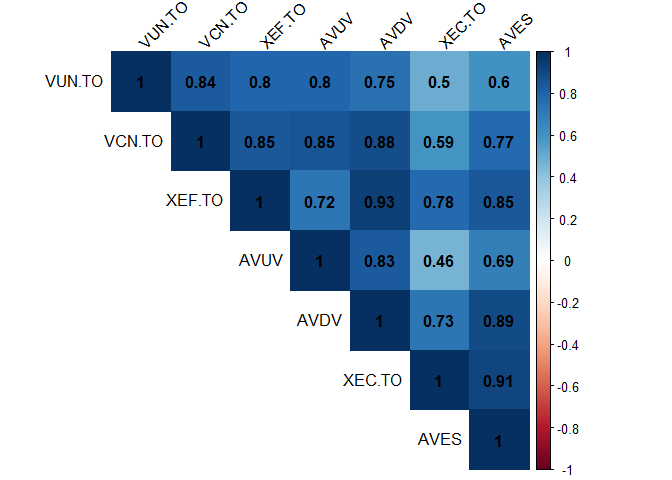
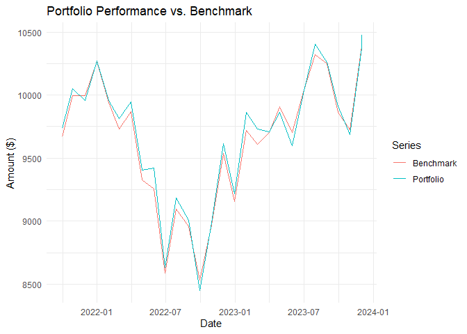

This post is a follow-up to a previous post where we created data tables with values and metrics from tickers in a portfolio. I will be using the same data tables (see the code here). In this post, we will calculate portfolio returns and create charts and graphs.

## Create a pie chart of the portfolio

We will use `ggplot2` to create a pie chart. In the previous thread, we used the `tidyverse` package which contains `ggplot2`, `dyplr`, and other useful packages. Let's load it here again.

```r 
  library(tidyverse) #or ggplot2

# Convert Ticker to a factor with levels ordered by Weight. This is for the ordering of the slices in the chart.
  financial_data$Ticker <- factor(financial_data$Ticker, levels = 
  financial_data$Ticker[order(financial_data$Weight, decreasing =  FALSE)])

# Create the pie chart.
ggplot(financial_data, aes(x = "", y = Weight, fill = Ticker)) +
  geom_bar(stat = "identity", width = 1, linewidth = 1, colour="white") +
  coord_polar("y") + #transform the geom_bar (stacked bar) into a circle (pie)
  geom_text(aes(label = paste(round(Weight / sum(Weight) * 100, 1), "%")), # text labels
            position = position_stack(vjust = 0.5), color="black") +
  labs(x = NULL, y = NULL, fill = NULL, 
         title = "Portfolio by Ticker Weight") +
    guides(fill = guide_legend(reverse = TRUE)) + #reverses legend
    scale_fill_manual(values = c("#808000","green","lightblue", "#3b3b6d", "cyan", "maroon", "blue")) +
    theme_void() +
    theme(plot.title = element_text(hjust = 0.5, color = "#666666")) #color the chart
```


## Calculating stock returns[^footnote]

The `quantmod` package will be used to pull stock data from Yahoo Finance and set up a function to get the monthly returns. 

```r 
library(quantmod)

#Function to get monthly returs. It takes two arguments.
monthly_returns <- function(ticker, base_year)
{
  # Obtain stock price data from Yahoo! Finance
  stock <- getSymbols(ticker, src = "yahoo", auto.assign = FALSE) 
  # Remove missing values
  stock <- na.omit(stock)
  # Keep only adjusted closing stock prices
  stock <- stock[, 6]
  
  # Confine our observations to begin at the base year and end at the last available trading day
  horizon <- paste0(as.character(base_year), "/", as.character(Sys.Date()))
  stock <- stock[horizon]
  
  # Calculate monthly arithmetic returns
  data <- periodReturn(stock, period = "monthly", type = "arithmetic")
  
  # Assign to the global environment to be accessible
  assign(ticker, data, envir = .GlobalEnv)
}
```

We now call our function for each stock in the portfolio.

```r 
# Call our function for each stock. I am using 2021 as it is the starting year
# for some tickers in the portfolio.
monthly_returns("VUN.TO", 2021)
monthly_returns("VCN.TO", 2021)
monthly_returns("XEF.TO", 2021)
monthly_returns("AVUV", 2021)
monthly_returns("AVDV", 2021)
monthly_returns("XEC.TO", 2021)
monthly_returns("AVES", 2021)

# Merge all the data and rename columns
returns <- merge.xts(VUN.TO, VCN.TO, XEF.TO, AVUV, AVDV, XEC.TO, AVES)
colnames(returns) <- c("VUN.TO", "VCN.TO", "XEF.TO", "AVUV", "AVDV", "XEC.TO", "AVES")

# Print last 5 rows of the data, rounded to 4 decimal places
round(tail(returns, n = 5), 4)
```

|          |VUN.TO | VCN.TO| XEF.TO | AVUV | AVDV  | XEC.TO| AVES  |
|:---------|:------|:------|:------|:------|:------|-------|------:|
|2023-08-31| 0.0066|-0.0124|-0.0139|-0.0361|-0.0284|-0.0370|-0.0538|
|2023-09-29|-0.0438|-0.0320|-0.0305|-0.0355|-0.0225|-0.0239|-0.0125|
|2023-10-31|-0.0064|-0.0310|-0.0136|-0.0502|-0.0334|-0.0165|-0.0394|
|2023-11-30| 0.0690| 0.0741| 0.0603| 0.0854| 0.0663| 0.0572| 0.0836|
|2023-12-01| 0.0041| 0.0104| 0.0059| 0.0311| 0.0129| 0.0000| 0.0083|

## Analyzing portfolio composition. 

Using the `corrplot` package, a specialized package designed for visualizing correlation matrices, we can quickly grasp the correlation between the stocks in the portfolio. Since they are all equities, you expect a positive correlation. The AV tickers (like AVUV) overlap with the other funds, with an added tilt towards (small cap) value. In the case of this portfolio, we expect a strong correlation between these groups:

- VUN.TO & AVUV
- XEF.TO & AVDV
- XEC.TO & AVES

```r
library(corrplot)
returns_corr <- na.omit(returns) # omit "NA" values from returns, if any
corr_matrix <- cor(returns_corr) # create a corr data table
#Display only the upper triangle of the matrix
corrplot(corr_matrix, method = "color", type = "upper",
         addCoef.col = "black", tl.col = "black", tl.srt = 45)
```


## Making a graph of the portfolio returns compared to a benchmark

We are now loading the `PerformanceAnalytics` package to calculate the portfolio's return. Once again we will be using `ggplot2` to make a chart with two lines: the returns in our portfolio and the returns of a benchmark stock. In this case, the chosen benchmark is the ticker VEQT.TO, an all-in-one ETF consisting of 100% equities with international diversification. The initial investment will be of 10,000.

```r
library(PerformanceAnalytics)

# Calculate benchmark returns and add to a dataframe
monthly_returns("VEQT.TO", 2021)
# Merge to a new dataframe "returns_bm" the data and rename columns
returns_bm <- merge.xts(returns, VEQT.TO)
returns_bm <- na.omit(returns_bm) #Omit 'NA' values
colnames(returns_bm) <- c("VUN.TO", "VCN.TO", "XEF.TO", "AVUV", "AVDV", "XEC.TO", "AVES", "VEQT.TO") # Rename columns


initial_investment <- 10000

# Only select first seven columns to isolate our individual stock data
portfolio_returns <- Return.portfolio(R = returns_bm[,1:7], weights = portfolio_weights, wealth.index = TRUE) * initial_investment

# Then isolate our benchmark ticker
benchmark_returns <- Return.portfolio(R = returns_bm[,8], wealth.index = TRUE) * initial_investment

# Merge the two
comp <- merge.xts(portfolio_returns, benchmark_returns)
colnames(comp) <- c("Portfolio", "Benchmark")

# Convert to data frame
comp_df <- data.frame(Date = index(comp), Portfolio = comp[,1], Benchmark = comp[,2])

comp_long <- pivot_longer(comp_df, cols = c(Portfolio, Benchmark), 
                          names_to = "Series", values_to = "Value")

library(ggplot2)

ggplot(comp_long, aes(x = Date, y = Value, color = Series)) +
  geom_line() +
  labs(title = "Portfolio Performance vs. Benchmark",
       y = "Amount ($)",
       x = "Date") +
  theme_minimal()

```


> You can also use the `dygraphs` package to create your chart. This package uses JavaScript charting library to create interactive plots allowing you to zoom and hover over point for more details.
{: .prompt-tip }

This is it for now.

[^footnote]: Thank you to C. Kincaid for the tips from his [Medium article](https://towardsdatascience.com/building-and-testing-stock-portfolios-in-r-d1b7b6f59ac4).